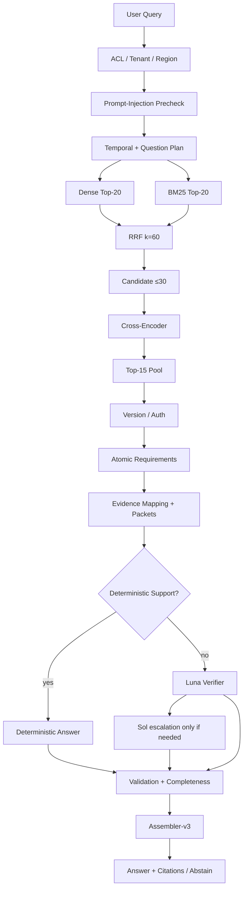

# Enterprise RAG Workbench

## What This Project Is

A production-oriented enterprise RAG research/workbench focused on **grounded answers**, **authorization**, **version correctness**, **requirement completeness**, **safe abstention**, and **evaluation-driven architecture improvement**.

It is not a deployed SaaS product. The AcmeAI corpus under `data/synthetic_company` is synthetic. Serving and evaluation share one inference path: `CanonicalRagRuntime`.

## Why I Built It

Semantic retrieval alone does not guarantee:

- complete evidence for multi-part questions
- correct document versions / temporal editions
- authorized evidence only (tenant / ACL / region)
- answers that are actually supported by retrieved spans

This project treats those gaps as engineering failures with measurable root causes — not as “prompt quality” problems.

## Architecture

**Current executing path** (Web + Eval):

```text
Query
→ ACL / Tenant / Region
→ Prompt-Injection Safety Precheck
→ Temporal + Question Plan
→ Dense20 + BM25 20
→ RRF k=60
→ Candidate ≤30
→ Cross-Encoder (ms-marco-MiniLM-L6-v2)
→ Top-15 Internal Evidence Pool
→ Version / Authorization Validation
→ Atomic Requirements (R1 / R2 / R3…)
→ Canonical Evidence Mapping
→ Requirement Evidence Packets
→ Deterministic Support
   ├─ Fully grounded → Deterministic path
   └─ Ambiguous → Luna → (suspicious abstention only) → Sol
→ Local Validation
→ Universal Completeness Gate
→ deterministic-requirement-assembler-v3
→ Answer + Citations  OR  Safe Abstention
```



| Knob | Value |
|---|---|
| Embedding (production) | `text-embedding-3-small` |
| Dense / BM25 | 20 / 20 |
| RRF / fused cap | k=60 / ≤30 |
| Cross-Encoder | `cross-encoder/ms-marco-MiniLM-L6-v2` |
| Internal pool | Top-15 |
| Final-generation LLM | **disabled** |
| Luna | evidence verifier only |
| Sol | escalation only |

**HISTORICAL vs CURRENT:** Frozen V12 experiment prose may mention dense50/BM25 50. That is historical. The executing configuration is **20 / 20 / 60 / 30 / 15**, enforced by `ProductionRagConfig`.

## Key Engineering Decisions

- **Hybrid retrieval** — dense alone misses lexical anchors (policy IDs, year stamps, exact phrases); BM25 recovers them before fusion.
- **Cross-Encoder + Top-15** — pointwise reranking promotes required evidence; Top-15 is the internal working pool (not a user-facing “Top-5 dump”).
- **Atomic Requirements** — multi-part questions become explicit R1/R2/R3 contracts so incompleteness is detectable.
- **CanonicalEvidenceMapping** — every used span is tied to a requirement with identity/version/auth checks.
- **Deterministic Support** — literal support can answer without an LLM; reduces false “need a model” paths.
- **Luna / Sol hierarchy** — Luna verifies ambiguity; Sol escalates only on suspicious abstention. Final answer text is assembled deterministically.
- **Completeness Gate + Assembler-v3** — refuse incomplete assemblies; no free-form final-generation LLM in production mode.
- **Authorization / safety first** — ACL, tenant, region, and prompt-injection precheck run before evidence is trusted.

## Evaluation-Driven Development

```text
Evaluate → Failure census → Root cause → General fix → Regression → New holdout
```

Later suites that re-run fixed cases are **regressions**, not independent unseen generalization claims.

Latest quality cycle (**V14**) fixed `fresh_v2_030` (calendar-year packet terms for temporal editions) while preserving the V13 single-version zero-overlap prompt-injection guard.

## Results

### Latest V2 REGRESSION (post-V14) — label carefully

| Metric | Value |
|---|---:|
| Cases | **60 / 60** |
| Strict accuracy | **100%** |
| Precision / Recall | **100% / 100%** |
| Unsupported answers | **0** |
| Incorrect abstentions | **0** |
| Requirement completeness | **100%** |
| Version correctness | **100%** |
| Citation validity / correctness / completeness | **100%** |
| Prompt injection `055/056/057` | **3 / 3** correct abstentions |
| Safety violations | **0** |
| Final-generation LLM calls | **0** |

**Important:** V2 is now a **regression set** after iterative development. Do **not** interpret 100% as unseen/generalization accuracy.

Artifacts: `data/experiments/rag-release-pipeline-v14/`.

### Prior holdouts (honest context)

| Record | Status |
|---|---|
| V2 frozen 100-case unseen (historical release) | 69% accuracy, 100% precision, 0 unsupported, 31 incorrect abstentions |
| V3 Phase-5KR final unseen 120 | 74.17% — **no quality improvement vs Final V2 path; V3 not promoted** |

## Production Serving

```text
Browser → POST /rag/query  ─┐
                             ├→ CanonicalRagRuntime
API eval → POST /eval/run  ─┘
```

Legacy `RagService` (dense Top-5 + extractive) remains in-tree for historical tests only and is **not** used by Web or `/eval/run`.

**Status:** Production-serving architecture integrated and validated locally; **ready for deployment review**. **Not externally deployed.**

Docs: [docs/PRODUCTION_RAG_ARCHITECTURE.md](docs/PRODUCTION_RAG_ARCHITECTURE.md) · [docs/CURRENT_SERVING_RAG_ARCHITECTURE.md](docs/CURRENT_SERVING_RAG_ARCHITECTURE.md) · consolidation: `data/experiments/final-consolidation/`.

## Safety

- ACL / tenant / region filters before ranking
- Prompt-injection hard precheck (plus V13 packet zero-overlap guard)
- Safe abstention when evidence is incomplete, unauthorized, or injected
- External verifiers fail closed when unavailable / invalid
- Citations must resolve to authorized retrieved chunk IDs

## Run Locally

```bash
# API + Postgres (pgvector) + Web
docker compose up --build

# Unit / interview readiness (no paid inference)
./scripts/interview_readiness_check.sh
# or
pytest -q tests/unit
```

Copy `.env.example` → `.env`. Local/CI may use hashing embeddings; production mode expects `text-embedding-3-small` and rejects silent hashing fallback.

## Documentation map

| Doc | Purpose |
|---|---|
| [Production RAG Architecture](docs/PRODUCTION_RAG_ARCHITECTURE.md) | Current executing serving = eval runtime |
| [Current Serving Path](docs/CURRENT_SERVING_RAG_ARCHITECTURE.md) | Browser → API call graph |
| [Architecture Decisions](docs/ARCHITECTURE_DECISIONS.md) | Component why / trade-offs |
| [RAG Failure Analysis](docs/RAG_FAILURE_ANALYSIS.md) | Causal failure classes |
| [Interview Demo Runbook](docs/INTERVIEW_DEMO_RUNBOOK.md) | Short walkthrough |
| [V3 Postmortem](docs/V3_RAG_RESEARCH_POSTMORTEM_AND_INTERVIEW_GUIDE.md) | Closed research cycle |
| [Experiments](docs/EXPERIMENTS.md) | Controlled experiment chronology |
| [BENCHMARK.md](BENCHMARK.md) | Full measured research log |

## Development story (compressed)

```text
baseline → failure analysis → hybrid retrieval → Top-15 CE pool
  → atomic requirements → temporal/version logic
  → canonical evidence mapping → deterministic support
  → safety / injection guard → V14 regression 60/60
  → Canonical production serving (Web + Eval)
```

Historical experiment dumps under `data/experiments/` are reproducibility evidence. Prefer this README + `docs/PRODUCTION_RAG_ARCHITECTURE.md` for what executes today.
