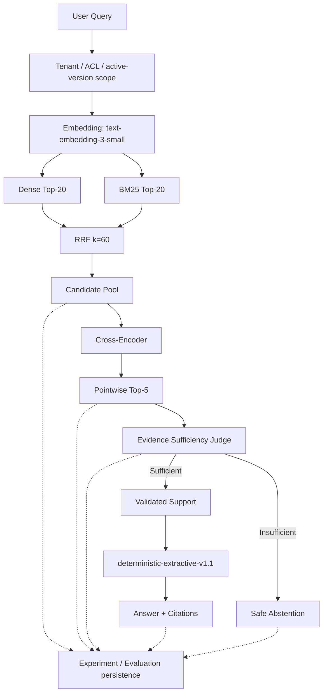

# Enterprise RAG Workbench

An enterprise-oriented RAG engineering and evaluation workbench for retrieval, ranking, evidence validation, safe abstention, security boundaries, and reproducible quality improvements.

It is a research and evaluation system, not a production SaaS product. The included AcmeAI knowledge base under `data/synthetic_company` is synthetic. It is not real company data. Every architecture change is measured against a frozen one-shot dataset, with one independent variable, precommitted promotion rules, and persisted failure traces.

**Stable release:** V2 (`enterprise-rag-workbench-v2`). Historical V1 remains frozen and visible. V3 and Agentic RAG are future research, not current features.

| Identity | Value |
|---|---|
| Architecture | `enterprise-rag-workbench-v2` |
| Parent | `enterprise-rag-workbench-v1` |
| Architecture hash | `964a639905502159e9e66d1b3b1bbfe7013a7f6e8cbc73a33d8412a91419a5da` |
| Final dataset | `acmeai-enterprise-rag-v2-final-eval` (100 unseen cases) |

---

## Stable release — V2 benchmark

Final V2 unseen benchmark. These numbers are a historical frozen record. A later V3 release must add its own section rather than overwrite this one.

```text
Final V2 Unseen Benchmark

Cases                  100
Accuracy               69.0%
Precision             100.0%
Recall                  65.9%
F1                      79.5%

Correct answers          60
Correct abstentions       9
Incorrect abstentions    31
Unsupported answers       0
```

Exact persisted values: Accuracy `0.690000`, Precision `1.000000`, Recall `0.659341`, F1 `0.794702`.

Safety on the same run:

```text
Citation validity       100%
Citation correctness    100%
ACL safety              100%
Tenant isolation        100%
Version correctness     100%
```

Candidate-pool all-required coverage `0.989011`. Top-5 all-required coverage `0.857143`. Three-document Top-5 coverage `0.666667`.

The system is intentionally fail-closed. It achieved 100% precision and zero unsupported answers on the final benchmark, but remained conservative, producing **31 incorrect abstentions**. The main remaining issue is evidence utilization / Judge false negatives, not candidate retrieval.

### V1 vs V2 (descriptive only)

| Metric | V1 final (80 cases) | V2 final (100 cases) |
|---|---:|---:|
| F1 | 0.516129 | 0.794702 |
| Precision | 1.000000 | 1.000000 |
| Unsupported answers | 0 | 0 |
| Incorrect abstentions | 45 | 31 |

**V1 and V2 final evaluations used different unseen datasets. This comparison is descriptive and is not a controlled paired A/B estimate of the causal V2 improvement.** Do not read these two finals as “V2 caused a +27.9 point F1 improvement.”

Controlled A/B evidence lives in [Controlled experiments](#controlled-experiments) and [`docs/EXPERIMENTS.md`](docs/EXPERIMENTS.md). The full measured log is [`BENCHMARK.md`](BENCHMARK.md).

---

## Architecture

Official V2 request path:

```text
Query
  → Authorized tenant / ACL / active-version scope
  → text-embedding-3-small
  → Dense Top-20 + BM25 Top-20
  → RRF k=60
  → Cross-Encoder
  → POINTWISE_CROSS_ENCODER_TOP5
  → GPT_5_6_SOL_EVIDENCE_SUFFICIENCY_V1
  → Validated supporting chunks
  → deterministic-extractive-v1.1
  → Answer + Citations  or  Safe Abstention
```



Stack: PostgreSQL 17 + pgvector, FastAPI, Next.js. Tenant, ACL, and active-version filters run **before** Dense and BM25. The Judge never sees hidden evaluator labels. Invalid supporting IDs fail closed.

---

## Engineering highlights

- Built RAG quality from a deterministic hashing baseline through semantic embeddings, hybrid retrieval, and local Cross-Encoder reranking.
- Designed frozen one-shot evaluation datasets with overlap guards so later suites are not paraphrases of earlier failures.
- Separated retrieval, ranking, Judge, and generation failures instead of collapsing them into one score.
- Used controlled A/B experiments with one independent variable and precommitted promotion criteria.
- Rejected candidates that missed those criteria, including Evidence Coverage v2 and document-diversity ranking.
- Implemented enterprise ACL / tenant / version boundaries before retrieval.
- Implemented bounded provider retry without retrying model-quality decisions.
- Maintained zero unsupported answers in the final V2 benchmark.

---

## Controlled experiments

These experiments support causal interpretation: one independent variable, sealed dataset, frozen promotion rule. Full chronology: [`docs/EXPERIMENTS.md`](docs/EXPERIMENTS.md). Decisions: [`docs/ENGINEERING_DECISIONS.md`](docs/ENGINEERING_DECISIONS.md).

### Hashing → Semantic embeddings

| | |
|---|---|
| Problem | Local hashing embeddings are a CI baseline, not semantic retrieval |
| Hypothesis | `text-embedding-3-small` improves recall without changing chunking, Top-K, threshold, or generator |
| Independent variable | Embedding provider / model |
| Baseline | `local-hashing-64` |
| Candidate | `text-embedding-3-small`, 64 dimensions |
| Dataset | `acmeai-eval-v1` (100 cases) |
| Measured delta | Recall@5 `0.740000` → `0.800000`; MRR `+0.060500`; nDCG `+0.073905`; multi-document Recall@5 `0.750000` → `1.000000` |
| Decision | **Accepted** for quality work. Hashing remains the offline/CI default |

### Dense → Cross-Encoder reranking

| | |
|---|---|
| Problem | Required evidence often sits in Dense Top-20 but not Top-5 |
| Hypothesis | A local Cross-Encoder improves Top-5 coverage of the same authorized pool |
| Independent variable | Final ordering of Dense Top-20 |
| Baseline | Dense cosine Top-5 |
| Candidate | `cross-encoder/ms-marco-MiniLM-L6-v2` revision `233902d25c440f23af6f7d6e94d2946bac0bee0a` |
| Dataset | `acmeai-reranking-eval-v1` (60 cases) |
| Measured delta | All-required Coverage@5 `0.777778` → `0.972222`; three-document Coverage@5 `+0.454545` |
| Decision | **Accepted** `DENSE_CROSS_ENCODER_RERANK` |

### GPT-5.6 Luna → GPT-5.6 Sol Judge

| | |
|---|---|
| Problem | Retrieval-complete Evidence Sufficiency false negatives |
| Hypothesis | Sol reduces those false negatives without increasing unsupported answers |
| Independent variable | Judge model identity only |
| Baseline | `gpt-5.6-luna` / `evidence-sufficiency-v1` |
| Candidate | `gpt-5.6-sol` / identical prompt, schema, and request settings |
| Dataset | `acmeai-sol-judge-e2e-eval-v1` (60 cases) |
| Measured delta | Correct answers `28` → `36`; F1 `0.700000` → `0.818182`; retrieval-complete recall `+0.186047`; unsupported `0` → `0` |
| Decision | **Accepted** `GPT_5_6_SOL_EVIDENCE_SUFFICIENCY_V1` |

Hybrid Dense+BM25 was adopted later by a pre-registered 80-case replication (Coverage@5 `0.797297` → `0.932432`, three-document Coverage@5 `0.650000` → `0.875000`), after an earlier calibration missed its materiality bar and was not rewritten. V2 keeps that hybrid candidate-generation path.

---

## Failure analysis

Official V2 failed-answerable census (31 incorrect abstentions; 0 unsupported answers):

```text
Evidence Gate False Negative          17
Cross-Encoder Failed to Promote        7
Cross-Encoder Demoted Evidence         5
Candidate Generation Miss              2
```

Candidate generation is already close to complete (pool all-required coverage `0.989011`, 2 misses). Most remaining losses occur after candidate generation:

1. Final evidence ranking (12 Cross-Encoder promote/demote failures)
2. Evidence utilization / Judge behavior (17 retrieval-complete false negatives)

### Retrieval funnel

These metrics have **different denominators**. They are not a single percentage converted four times.

```text
Candidate Pool All Required Coverage     98.90%   (all required evidence in the hybrid union)
        ↓
Top-5 All Required Coverage              85.71%   (all required evidence in final Top-5)
        ↓
Retrieval-complete Judge Recall          77.33%   (58/75 complete answerable cases)
        ↓
Final answerable correct-answer rate     65.93%   (60/91 answerable cases)
```

Stage counts on answerable cases: 91 answerable → 90 candidate-complete → 75 Top-5 complete → 58 Judge-approved → 60 correct final answers (5 generator fallbacks among the 60).

---

## Security

Authorization is applied before retrieval. Restricted chunks never become Dense, BM25, Cross-Encoder, or Judge candidates for unauthorized principals.

| Control | Behavior |
|---|---|
| Tenant filtering | SQL predicate before ranking |
| ACL filtering | Permission groups before ranking |
| Active-version filtering | Only the current version is searchable |
| Support validation | Judge supporting IDs must be in the authorized Top-5 |
| Content identity validation | Supporting chunk text must match stored content |
| Prompt-injection boundary | Retrieved text is untrusted DATA, not system policy |
| Citation validation | Citations must map to retrieved chunk IDs |

Final V2 metrics: ACL safety 100%, tenant isolation 100%, version correctness 100%, unauthorized downstream evidence **0**, prompt-injection boundary 100% (4/4).

---

## Reliability

V2 reliability hardening did not change ranking or Judge quality policy.

| Mechanism | Role |
|---|---|
| `deterministic-extractive-v1.1` | Offline extractive answers from validated support only |
| Verbatim validated-support fallback | If extractive synthesis fails, emit supporting text rather than invent |
| Typed `GENERATION_FAILURE` | Generator exceptions are explicit; they are not silent empty answers |
| Bounded transport retries | At most 2 physical attempts; `TIMEOUT` / `CONNECTION_ERROR` / `RATE_LIMIT` / `PROVIDER_5XX` only |
| Logical vs physical accounting | One logical Judge request may use a second physical attempt |
| Idempotency | One decision per logical request; successful paid calls are not replayed |

Final V2 benchmark evidence: 100 logical Judge requests, 101 physical Sol attempts, 1 transport recovery, 0 final `JUDGE_REQUEST_ERROR`, 0 `GENERATION_FAILURE`, 0 silent generation failure.

---

## What I tested and rejected

Verified results only. Proxy stand-ins are labeled. Methods that were not run are `NOT_EXECUTED`, not empirically rejected.

| Candidate | Status | Evidence |
|---|---|---|
| Evidence Coverage v2 | **Rejected** | Correct answers 37 → 33; incorrect abstentions 15 → 19; 5 regressions vs 1 rescue |
| Hard one-chunk-per-document diversity | **Rejected** | Three-document Coverage@5 +0.055556, below +0.15; same-document multi-chunk coverage 1.000000 → 0.000000; 7 regressions vs 2 rescues |
| Max-two-chunks-per-document | **Rejected** | Coverage deltas 0.000000; Control A never occupied 3+ slots, so the cap selected identical Top-5 sets |
| Evidence Sufficiency prompt v2 | **Rejected** | Retrieval-complete Judge recall unchanged at 0.741379; 3 rescues vs 3 regressions; below +0.12 / ≥8-rescue bar |
| Lexical rewrite / multi-query BM25 / template HyDE | **Rejected proxy** | Post-V2 quality A/B; below frozen materiality bar; not LLM rewrite / embedding HyDE |
| Contextual sparse lite / 3-way sparse fusion | **Rejected proxy** | Identifier-weighted TF-IDF, **not** neural SPLADE |
| Sentence MaxSim | **Rejected proxy** | Local sentence vectors, **not** real ColBERT |
| Query decomposition | **Rejected proxy** | Two- and three-document questions only |
| LLM query rewrite, embedding HyDE, neural SPLADE, real ColBERT | **Not executed** | Paid or infrastructure methods were not authorized |
| GraphRAG | **Inconclusive / not needed by current failure data** | Official V2 losses are Judge FN and ranking, not graph retrieval. No GraphRAG implementation was run |

Post-V2 controlled research **accepted no architecture change**. Official V2 ranking remains `POINTWISE_CROSS_ENCODER_TOP5`. Official V2 Judge remains `GPT_5_6_SOL_EVIDENCE_SUFFICIENCY_V1`.

---

## Synthetic scalability stress test

This is **not** production-corpus performance. Larger corpora were synthetic hard-negative distractors on the V2 retrieval stack.

| Scale | Recall@20 |
|---|---:|
| Current research corpus | 0.994505 |
| 10k synthetic hard negatives | 0.822511 |
| 500k synthetic hard negatives | 0.826840 |

At 500k, Dense p95 was 81.99 ms and BM25 p95 was 1426.34 ms. Large-scale hard-negative retrieval remains a **V3 research problem**.

---

## Known limitations

These are disclosed, not repaired in this release-hardening phase.

- 17 retrieval-complete Evidence Gate false negatives
- 12 ranking-stage failures (7 failed to promote, 5 demoted required evidence)
- 2 candidate-generation misses
- Near-duplicate weakness (preferred-source Top-5 success 0.625000; 8 incorrect abstentions)
- Three-document ranking loss (Top-5 coverage 0.666667 despite pool coverage 1.000000)
- Synthetic large-corpus retrieval degradation (Recall@20 ≈ 0.82 at 10k–500k hard negatives)

The extractive generator does not claim semantic answer correctness. Claim-level verification is future work.

---

## Quick start

Requirements: Docker Desktop with Compose, Python 3.12+, Node.js 22+.

### Offline / deterministic path

No paid APIs. Uses hashing embeddings and extractive generation. Semantic retrieval, Cross-Encoder quality path, and Sol judging are **not** exercised.

```bash
cp .env.example .env
docker compose up -d db
python3 -m venv .venv
source .venv/bin/activate
python -m pip install -e '.[dev]'
alembic upgrade head
python -m rag_workbench.cli ingest data/synthetic_company/*.md
uvicorn rag_workbench.api.app:app --reload
```

In another terminal:

```bash
npm --prefix apps/web install
npm --prefix apps/web run dev
```

Open `http://localhost:3000`. API docs: `http://localhost:8000/docs`. Health: `GET http://localhost:8000/health`.

Full stack after creating `.env`:

```bash
docker compose up --build
```

Docker Compose defaults keep `ALLOW_EXTERNAL_CALLS=false` and `ALLOW_EXTERNAL_JUDGE_CALLS=false`. Startup does not require paid model calls. The API container may still download the local Cross-Encoder snapshot into a Docker volume on first use.

### What requires external credentials

Leave keys empty for offline work. Never commit `.env`.

| Feature | Variables |
|---|---|
| Semantic embeddings | `EMBEDDING_PROVIDER=openai-compatible`, `EMBEDDING_API_KEY`, `ALLOW_EXTERNAL_CALLS=true`, reviewed `MAX_EXTERNAL_EMBEDDING_CALLS` |
| Hosted Sol Judge | `JUDGE_API_KEY` (or intentional fallback to `EMBEDDING_API_KEY`), `ALLOW_EXTERNAL_JUDGE_CALLS=true`, reviewed `MAX_EXTERNAL_JUDGE_CALLS` |
| Optional hosted generation | `LLM_PROVIDER=openai`, `OPENAI_API_KEY` — not used by frozen V2 extractive generation |

`.env` and `.env.local` are gitignored. `.env.example` contains placeholders only. Local Docker database defaults are `rag` / `rag` / `rag_workbench` on localhost:5432.

---

## Testing

Deterministic gates. They do not call paid inference:

```bash
alembic upgrade head
alembic check
pytest -q
ruff check .
npm --prefix apps/web run typecheck
npm --prefix apps/web run build
```

CI runs the same checks against PostgreSQL 17 + pgvector. Do not rerun the frozen V2 paid benchmark to “refresh” README numbers.

Useful local commands:

```bash
python -m rag_workbench.cli validate-dataset data/eval/eval_v1.json
python -m rag_workbench.cli experiment run \
  --config configs/baseline-hashing-eval-v1.yaml \
  --dataset data/eval/eval_v1.json
```

---

## Future V3 research

**Future research, not current features.** Priority follows measured V2 bottlenecks:

1. Generate → Verify recovery for Judge false negatives
2. Claim-level evidence verification
3. Final evidence ranking improvement
4. Large-corpus retrieval under hard negatives
5. Corrective retrieval
6. Agentic RAG — possible later architecture: RAG plus GitHub, SQL, Notion, Web, Gmail, and Calendar, with risk-tiered approval. **Not implemented.**

V3, if it exists later, must be documented as its own release. Historical V2 results stay on this page.

---

## License

MIT. See [LICENSE](LICENSE).

---

## Repository map

```text
apps/web                     Next.js evaluation UI
services/api                 API container
src/rag_workbench            FastAPI app, retrieval, Judge, experiments
data/synthetic_company       Searchable synthetic corpus
data/eval                    Frozen evaluation datasets
data/experiments             Persisted research artifacts
docs/                        Engineering decisions and experiment chronology
migrations                   Alembic history (additive; do not rewrite)
BENCHMARK.md                 Full measured research log
```

Experiment and benchmark scripts under `scripts/` and `src/rag_workbench/experiments/` are **reproducible research**, not dead code. Do not delete them because they are outside the live V2 request path.
