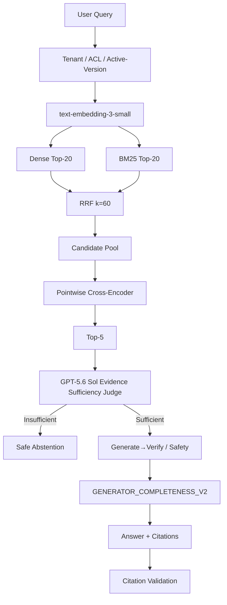

# Architecture Decisions

Interview-oriented component guide for Enterprise RAG Workbench.

**Stable release:** V2 (`main` / `v2.0.0`).  
**V3 research:** closed and **not promoted** (`V3_QUALITY_IMPROVEMENT_NOT_CONFIRMED`, `V3_RELEASE_PROMOTION_REJECTED`).

Related: [`ENGINEERING_DECISIONS.md`](ENGINEERING_DECISIONS.md) (frozen V2 design narrative), [`RAG_FAILURE_ANALYSIS.md`](RAG_FAILURE_ANALYSIS.md), [`V3_RAG_RESEARCH_POSTMORTEM_AND_INTERVIEW_GUIDE.md`](V3_RAG_RESEARCH_POSTMORTEM_AND_INTERVIEW_GUIDE.md).

## Canonical pipeline

Primary orchestration: `RagService.query` in `src/rag_workbench/generation/generator.py`.  
HTTP entry: `POST /rag/query` in `src/rag_workbench/api/app.py`.

---

## Dense Retrieval

| | |
|---|---|
| **WHAT** | Semantic nearest-neighbor search over chunk embeddings (Top-20) |
| **WHY** | Paraphrase and meaning match where keywords differ |
| **WHY THIS DESIGN** | Controlled A/B: hashing → `text-embedding-3-small` improved Recall@5 / MRR / nDCG without changing chunking or Top-K |
| **TRADE-OFF** | Misses exact identifiers/codes; needs paid or hosted embeddings for quality path |
| **LIMITATION** | Alone, required evidence often sits in Top-20 but not Top-5 |

Code: `src/rag_workbench/retrieval/retriever.py`, `providers/embeddings/`

## BM25

| | |
|---|---|
| **WHAT** | Lexical Okapi BM25 Top-20 over an ACL/tenant/version-scoped corpus |
| **WHY** | Exact codes, policy identifiers, and rare tokens |
| **WHY THIS DESIGN** | Dense+BM25 hybrid beat dense-only on sealed multi-doc coverage (replication) |
| **TRADE-OFF** | Weak on paraphrase; score scale incompatible with cosine |
| **LIMITATION** | Not neural sparse (not SPLADE) |

Code: `src/rag_workbench/retrieval/bm25.py`

## RRF

| | |
|---|---|
| **WHAT** | Reciprocal Rank Fusion (`k=60`) over Dense and BM25 lists → candidate pool (union ≤ 30) |
| **WHY** | Merge ranked lists without calibrating incompatible scores |
| **WHY THIS DESIGN** | Deterministic, cheap, stable; dense threshold never applied to BM25/RRF scores |
| **TRADE-OFF** | Does not learn relative list weights |
| **LIMITATION** | Pool can be near-complete while Top-5 still misses required evidence |

Code: `src/rag_workbench/retrieval/hybrid.py`

## Cross-Encoder (pointwise)

| | |
|---|---|
| **WHAT** | Local `cross-encoder/ms-marco-MiniLM-L6-v2` scores query–chunk pairs; selects Top-5 |
| **WHY** | Promote required evidence from the authorized pool into Top-5 |
| **WHY THIS DESIGN** | Sealed rerank eval: Coverage@5 0.778 → 0.972; pinned revision for reproducibility |
| **TRADE-OFF** | Local CPU/GPU cost; still pointwise (not set-aware by default) |
| **LIMITATION** | Official V2 census: promote/demote failures remain; pairwise complementarity improved retrieval but failed E2E promotion |

Code: `src/rag_workbench/reranking/cross_encoder.py`

## Top-5

| | |
|---|---|
| **WHAT** | Final evidence window passed to Judge and generator |
| **WHY** | Bound Judge cost and context while covering multi-document cases |
| **WHY THIS DESIGN** | Locked with V2 research path; aligns with measured Coverage@5 experiments |
| **TRADE-OFF** | Incomplete multi-doc sets when ranking fails |
| **LIMITATION** | Three-document and version-sensitive categories remain hard on the final unseen set |

## Evidence Sufficiency Judge

| | |
|---|---|
| **WHAT** | GPT-5.6 Sol (`evidence-sufficiency-v1`) decides whether Top-5 can support a complete answer; emits supporting chunk IDs |
| **WHY** | Separate *sufficiency* from *relevance*; stop unsupported answers from public-but-irrelevant chunks |
| **WHY THIS DESIGN** | Sol vs Luna controlled A/B improved correct answers without raising unsupported count |
| **TRADE-OFF** | Paid calls; fail-closed on invalid IDs; can over-abstain |
| **LIMITATION** | Judge false negatives exist; do not attribute all incorrect abstentions to the Judge |

Code: `src/rag_workbench/answerability/openai_compatible.py`, `answerability/validation.py`

## Generate→Verify / Safety

| | |
|---|---|
| **WHAT** | V3 research overlays: recovery, instruction boundary, injection guards, constraint guards, safe recovery boundary |
| **WHY** | Reduce unsupported answers and instruction-following from untrusted retrieved text |
| **WHY THIS DESIGN** | Measured in Phases 5C–5H; components accepted or rejected per holdout evidence |
| **TRADE-OFF** | Extra abstention risk; lexical guards do not generalize to novel attacks |
| **LIMITATION** | Phase-5H injection holdout **14/20**; V3 guard expansion regressed vs V2 |

Code: `src/rag_workbench/recovery/`, `src/rag_workbench/safety/`

## Generator (`GENERATOR_COMPLETENESS_V2`)

| | |
|---|---|
| **WHAT** | Deterministic extractive selection with per-chunk-diverse sentences; citations from validated support |
| **WHY** | Avoid free-form hallucination; fix multi-doc omissions from global top-2 overlap |
| **WHY THIS DESIGN** | Phase-5C diagnostic: +13.33 pp with 16 rescues / 0 regressions on that dataset |
| **TRADE-OFF** | Limited synthesis; not semantic answer grading |
| **LIMITATION** | Did not produce a net final-benchmark win vs stable V2 (all arms 74.17%) |

Code: `src/rag_workbench/providers/llm/extractive.py`  
Note: Frozen V2 also documents `deterministic-extractive-v1.1` as the historical release generator identity.

## Citation validation

| | |
|---|---|
| **WHAT** | Citations must map to retrieved / authorized chunk IDs; support checks use cited text |
| **WHY** | Auditability and unsupported-answer control |
| **WHY THIS DESIGN** | Fail-closed enterprise requirement |
| **TRADE-OFF** | Strictness can classify incomplete answers as unsupported |
| **LIMITATION** | Scorer contracts must match dataset schema (`required_facts` vs `expected_answer`) |

Code: `src/rag_workbench/generation/citations.py`, `evaluation/final_e2e_scorer_v2.py`

## ACL

| | |
|---|---|
| **WHAT** | Permission-group filters applied before retrieval candidates are scored |
| **WHY** | Restricted chunks must never enter Dense/BM25/CE/Judge for unauthorized principals |
| **WHY THIS DESIGN** | Pre-retrieval SQL predicates; measured 100% ACL safety on V2 final |
| **TRADE-OFF** | Over-restriction if labels misaligned with corpus |
| **LIMITATION** | Dataset label bugs can fake ACL failures (repaired in Phase-5G diagnostics) |

Code: `src/rag_workbench/security/`, `retrieval/filters.py`

## Tenant isolation

| | |
|---|---|
| **WHAT** | Tenant ID predicate before retrieval |
| **WHY** | Cross-tenant leakage is a hard fail |
| **WHY THIS DESIGN** | Same pre-retrieval filter pattern as ACL |
| **TRADE-OFF** | Multi-tenant corpora need careful principal fixtures in eval |
| **LIMITATION** | Eval labeling must match tenant fixtures |

## Active version filtering

| | |
|---|---|
| **WHAT** | Only current document versions are searchable |
| **WHY** | Compliance / avoid obsolete policy answers |
| **WHY THIS DESIGN** | SQL active-version filter before ranking |
| **TRADE-OFF** | Historical versions unavailable to retrieval by design |
| **LIMITATION** | Final version-sensitive category **0%**; version-aware ranking holdout saturated without gain |

## Safe abstention

| | |
|---|---|
| **WHAT** | Return no substantive answer when evidence is insufficient, unauthorized, or safety-blocked |
| **WHY** | Prefer incorrect abstention over unsupported / unsafe answers |
| **WHY THIS DESIGN** | Enterprise fail-closed posture; V2 final had 0 unsupported |
| **TRADE-OFF** | Hurts recall (incorrect abstentions) |
| **LIMITATION** | Phase-5KR: **27** incorrect abstentions; only **4** proven Judge FNs under strict audit |

---

## Interview one-liners

- Hybrid = semantic paraphrase + lexical identifiers.
- RRF = fuse ranks without score calibration.
- Cross-Encoder = pull required evidence into Top-5.
- Judge = sufficiency, not relevance ranking and not answer generation.
- Generator = extractive / cited; not free-form chat.
- V3 closed: **no quality lift on final benchmark** + **injection holdout 14/20** → keep V2.
