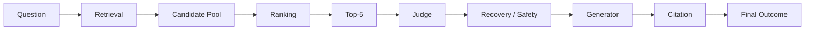

# RAG Failure Analysis

Causal failure attribution for Enterprise RAG Workbench.

**Rule:** Dataset **category** ≠ **causal failure class**.

Example: a `version_sensitive` question that fails after complete Top-5 retrieval is **not** automatically `VERSION_FAILURE`. Attribute to the earliest pipeline break that explains the outcome.

Authoritative final metrics and census: Phase-5KR artifacts under `data/experiments/v3-phase5k-final-e2e/`.

## Pipeline

```text
Question
  → Retrieval (Dense + BM25 under tenant/ACL/active-version)
  → Candidate Pool (RRF)
  → Ranking (Cross-Encoder)
  → Top-5
  → Judge (evidence sufficiency)
  → Recovery / Safety guards
  → Generator
  → Citation checks
  → Final Answer  or  Safe Abstention
```



## Failure classes

| Class | Meaning | Typical signal |
|---|---|---|
| `RETRIEVAL_MISS` | Required evidence never enters the authorized candidate pool | Pool all-required coverage fails |
| `RANKING_MISS` | Evidence in pool but not in Top-5 (failed promote / demote) | Pool complete, Top-5 incomplete |
| `JUDGE_FALSE_POSITIVE` | Judge says sufficient when evidence cannot support a complete grounded answer | Unsupported / unsafe answer risk |
| `JUDGE_FALSE_NEGATIVE` | Judge abstains despite Top-5 being retrieval-complete for required facts | Incorrect abstention with complete Top-5 |
| `RECOVERY_FAILURE` | Generate→Verify / recovery path does not rescue a recoverable draft | Research path; V3 overlays |
| `GENERATOR_INCOMPLETE` | Evidence present in context; answer misses required facts | Completeness metric drop |
| `GENERATOR_UNSUPPORTED` | Answer asserts content not supported by validated citations | Unsupported answer |
| `CITATION_FAILURE` | Citations missing, invalid IDs, or fail correctness/completeness | Citation rates below 1.0 |
| `PROMPT_INJECTION_FAILURE` | Attack question / retrieved instruction defeats injection boundary | Unsafe answer on injection holdout |
| `ACL_FAILURE` | Restricted evidence used or leaked for unauthorized principal | Unauthorized supporting IDs |
| `TENANT_FAILURE` | Cross-tenant evidence used | Tenant isolation breach |
| `VERSION_FAILURE` | Wrong document version used as supporting evidence | Version correctness fail |
| `CONSTRAINT_FAILURE` | Numeric/date relation in question not entailed by evidence | Constraint guard / wrong answer |

## Category vs cause

| Dataset category (examples) | Valid causal questions |
|---|---|
| `version_sensitive` | Was the correct version retrieved? Ranked into Top-5? Judge FN? Generator incomplete? |
| `three_document` / `multidoc` | Pool miss? Ranking miss of one doc? Generator omitted a chunk? |
| `prompt_injection` | Guard miss? Recovery enacted instruction? Unsupported leak? |
| `numeric_date_constraint` | Constraint semantics? Judge? Generator? |
| `acl_should_abstain` | True ACL miss vs public evidence answering a mislabeled case? |

Phase-5F lesson: **required evidence ≠ authorized evidence**. A supporting ID absent from ground-truth `required_chunk_ids` can still be authorized.

## How to attribute (practical order)

1. **Authorization / scope** — ACL, tenant, version filters before anything else.
2. **Retrieval pool** — Are all required chunks in the hybrid union?
3. **Ranking** — Are they in Top-5?
4. **Judge** — Sufficient vs insufficient; validate supporting IDs.
5. **Safety / recovery** — Injection, constraints, instruction boundary.
6. **Generator** — Completeness given the validated support.
7. **Citations / scorer** — Distinguish product failure from evaluation bugs.

## Evaluation bugs ≠ RAG bugs

| Historical defect | Symptom | Lesson |
|---|---|---|
| Invalid Phase-K runner | False **16.67%** | Verify provider identity and API spend before trusting aggregates |
| Phase-5KC scorer contract | False **16.67%** again | Scorer fields must match dataset schema |
| Required vs authorized metric | Fake “unauthorized” counts | Audit authorization separately |

Authoritative quality after correction: **74.17%** strict E2E (Phase-5KR).

## Remaining product limitations (not code-quality failures)

| Limitation | Evidence |
|---|---|
| Prompt injection | Phase-5H **14/20** |
| Three-document | Final category **0%** |
| Version-sensitive | Final category **0%** |
| Numeric/date | Final category **50%** |
| Over-abstention | **27** incorrect abstentions; **4** proven Judge FNs under strict audit |

## Code anchors

| Stage | Path |
|---|---|
| Orchestration | `src/rag_workbench/generation/generator.py` (`RagService.query`) |
| Hybrid retrieval | `src/rag_workbench/retrieval/hybrid.py` |
| Rerank | `src/rag_workbench/reranking/cross_encoder.py` |
| Judge | `src/rag_workbench/answerability/` |
| Safety | `src/rag_workbench/safety/` |
| Recovery | `src/rag_workbench/recovery/` |
| Generator | `src/rag_workbench/providers/llm/extractive.py` |
| Citations | `src/rag_workbench/generation/citations.py` |
| Final scorer V2 | `src/rag_workbench/evaluation/final_e2e_scorer_v2.py` |
