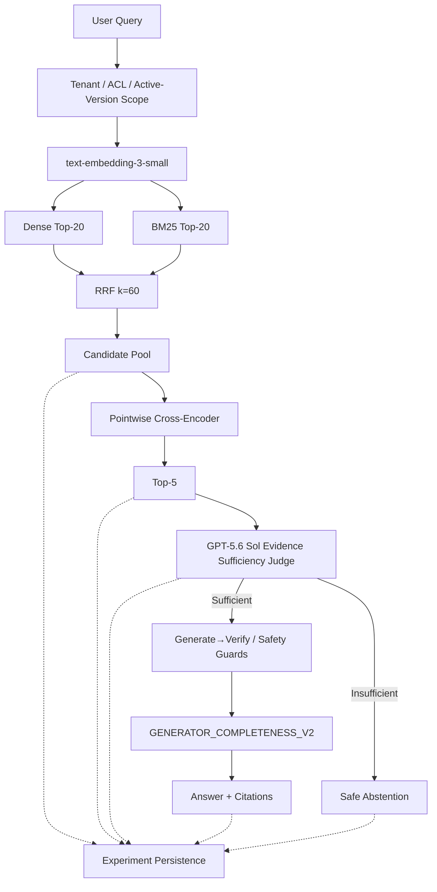

# Enterprise RAG Workbench — V3 Research Postmortem

**Research status:** `V3_RESEARCH_FULLY_CLOSED_AFTER_CORRECTED_SCORING`  
**Authoritative scoring source:** `V3_PHASE5KR_FINAL_CORRECTED_SCORING`  
**Production baseline:** V2 (`enterprise-rag-workbench-v2`, `main`, tag `v2.0.0`) — unchanged  
**Quick reference:** [`V3_RAG_INTERVIEW_CHEAT_SHEET.md`](V3_RAG_INTERVIEW_CHEAT_SHEET.md)

---

## 1. Executive Summary

### What this project is

The Enterprise RAG Workbench is a research and evaluation system for enterprise-grade retrieval-augmented generation. It ingests a synthetic AcmeAI knowledge base, retrieves authorized evidence under tenant/ACL/active-version constraints, reranks candidates, validates evidence sufficiency with a hosted Judge, generates deterministic cited answers (or abstains safely), and persists full experiment traces for reproducible quality measurement.

It is **not** a production SaaS product. It is an engineering workbench where every architecture change is tested against frozen datasets with one independent variable and precommitted promotion rules.

### Why V3 research existed

V2 established a stable enterprise RAG release (~69% strict accuracy on its own 100-case final benchmark, 100% precision, zero unsupported answers). V3 research asked whether controlled improvements to ranking, generator completeness, constraint semantics, and prompt-injection defenses could beat V2 on a **fresh unseen final benchmark** without regressing security.

### What was tested

Phases 5B–5KR explored:

- Pairwise complementarity ranking (5B, earlier cycle)
- Generator completeness (5C, 5J)
- Safety hardening: recovery boundaries, constraint guards (5D, 5E)
- Evaluation metric and dataset integrity (5F, 5G)
- Prompt-injection guard variants (5H)
- Version-aware ranking (5I)
- Final 120-case unseen E2E benchmark with three frozen arms (5K → 5KC → 5KR)

### What ultimately happened

After correcting two major evaluation defects (invalid Phase-K runner, broken citation scorer), the **authoritative final metrics** are:

| Metric | Value |
|---|---:|
| Strict E2E Accuracy | **74.17%** |
| Precision | 94.52% |
| Recall | 71.88% |
| F1 | 81.66% |
| Correct complete answers | 69 |
| Correct abstentions | 20 |
| Incorrect abstentions | 27 |
| Unsupported answers | 4 |
| Citation validity | 1.00 |
| Citation correctness | 0.945 |
| Citation completeness | 0.945 |
| Generator completeness (given complete evidence) | 89.61% |

**Stable V2 path (FINAL_R), current V3 (FINAL_A), and final V3 candidate (FINAL_B) all scored identically: 74.17%.**

### Why V3 was not promoted

| Decision | Verdict |
|---|---|
| Quality | `V3_QUALITY_IMPROVEMENT_NOT_CONFIRMED` — no net gain over stable V2 on the final benchmark |
| Security / release | `V3_RELEASE_PROMOTION_REJECTED` — Phase-5H targeted prompt-injection holdout **14/20** (6 unsafe failures) |

### Critical historical distinction

**Do not cite 16.67% as V3 quality.** That number came from invalid infrastructure:

| Stage | Problem | Reported accuracy |
|---|---|---:|
| Phase-K (original) | Invalid runner: hashing embeddings, Judge/recovery/generator bypass | 16.67% |
| Phase-5KC (corrected execution, broken scorer) | Valid pipeline but `expected_answer=None` forced citation correctness to 0 | 16.67% |
| **Phase-5KR (authoritative)** | Correct execution + `FINAL_E2E_SCORER_V2` | **74.17%** |

---

## 2. System Architecture

### Retained production path (V2)

```
Query
  ↓
Tenant / ACL / active-version scope (SQL predicates before retrieval)
  ↓
text-embedding-3-small
  ↓
Dense Top-20 + BM25 Top-20
  ↓
RRF k=60 → Candidate Pool (union, limit 30)
  ↓
Pointwise Cross-Encoder (ms-marco-MiniLM-L6-v2)
  ↓
Top-5
  ↓
GPT-5.6 Sol Evidence Sufficiency Judge (evidence-sufficiency-v1)
  ↓
Generate→Verify / Safety layers (research additions; not all promoted)
  ↓
GENERATOR_COMPLETENESS_V2 (deterministic-extractive-v2)
  ↓
Answer + Citations  OR  Safe Abstention
```

### Enterprise controls

| Control | Behavior |
|---|---|
| **ACL** | Permission groups filter chunks before Dense/BM25/reranking |
| **Tenant isolation** | Tenant ID SQL predicate; cross-tenant leakage blocked at retrieval |
| **Active-version filtering** | Only current document versions are searchable |
| **Supporting-ID validation** | Judge-emitted chunk IDs must exist in authorized Top-5 |
| **Content identity validation** | Supporting chunk text must match stored content |
| **Citation validation** | Citations map to retrieved chunk IDs; format checked |
| **Safe abstention** | Fail-closed when evidence insufficient, unauthorized, or safety guard triggers |
| **Prompt-injection boundary** | Retrieved text treated as untrusted DATA, not system policy |

### Architecture diagram



### Source-of-truth code paths

| Component | Path |
|---|---|
| Request orchestration | `src/rag_workbench/generation/generator.py` (`RagService`) |
| Hybrid retrieval + RRF | `src/rag_workbench/retrieval/hybrid.py`, `retriever.py` |
| BM25 | `src/rag_workbench/retrieval/bm25.py` |
| Cross-Encoder reranker | `src/rag_workbench/reranking/cross_encoder.py` |
| Evidence Judge | `src/rag_workbench/answerability/` |
| Extractive generator V2 | `src/rag_workbench/providers/llm/extractive.py` |
| Safety guards | `src/rag_workbench/safety/` |
| Final E2E scorer V2 | `src/rag_workbench/evaluation/final_e2e_scorer_v2.py` |

---

## 3. Evolution: V1 → V2 → V3

### V1 — Basic frozen baseline

Local hashing embeddings, deterministic extractive generation, early evaluation datasets. Established the offline/CI path and baseline metrics. Frozen and retained for historical comparison.

### V2 — Stable enterprise RAG release

Accepted controlled improvements: semantic embeddings, hybrid Dense+BM25+RRF, Cross-Encoder reranking, GPT-5.6 Sol Judge. Final unseen benchmark (100 cases): **69.0% accuracy**, 100% precision, 0 unsupported answers, 31 incorrect abstentions. This is the **production architecture** (`main`, `v2.0.0`).

### V3 — Research cycle (not production)

Explored ranking complementarity, Generate→Verify recovery, generator completeness, constraint semantics, prompt-injection guards, version-aware ranking, and evaluation robustness. Produced real component-level wins and critical evaluation lessons. **Did not meet promotion gates.** V2 remains stable.

---

## 4. Main Research Questions

V3 attempted to answer:

1. **Can ranking improve multi-document evidence coverage?**  
   Pairwise complementarity improved retrieval metrics historically but failed E2E promotion gates (Phase 5B and earlier cycle).

2. **Can generator completeness improve answers when evidence is already present?**  
   Yes in controlled isolation (Phase-5C); no net final benchmark advantage when combined with full pipeline (Phase-5KR).

3. **Can prompt-injection safety improve without over-abstention?**  
   V3 lexical expansion (QUESTION_INJECTION_GUARD_V3) did **not** generalize; performed worse on fresh holdout (Phase-5H).

4. **Can version-aware ranking generalize?**  
   Historical 3-case motivation existed; fresh holdout showed baseline already saturated — no measurable gain (Phase-5I).

5. **Can constraint semantics distinguish exact/range/date relationships?**  
   V1 had boundary bugs (GT ≠ GE); V2 guard improved diagnostic holdouts (Phase-5E). Final numeric/date category still 50% on authoritative benchmark.

---

## 5. What Worked

### GENERATOR_COMPLETENESS_V2

**Root cause (Phase-5C audit):** `overlap_candidates()` selected top-2 sentences globally by query-term overlap. For multi-document queries, both sentences could come from one chunk, omitting required facts from other documents.

**Fix:** Per-chunk-diverse sentence selection before global fill (`deterministic-extractive-v2`, algorithm `GENERATOR_COMPLETENESS_V2`).

**Historical controlled effect (Phase-5C, diagnostic dataset `v3_clean_120_cases`, FULL slice):**

| Arm | Strict accuracy | Label |
|---|---:|---|
| A — Current V3 (baseline generator) | **61.67%** | historical controlled |
| C — Generator only (GENERATOR_COMPLETENESS_V2) | **75.00%** | historical controlled |
| Delta | **+13.33 pp** | |
| Rescues | **16** | |
| Regressions | **0** | |

This was a **real controlled improvement** on that diagnostic benchmark. It did **not** produce a final generalization advantage over stable V2 on the authoritative 120-case final benchmark (all arms 74.17%).

**Evidence:** `data/experiments/v3-phase5c-audit-corrected/summary.json`, `data/eval/phase5c/generator_diagnostic.json`

### Constraint Guard V2

Phase-5E diagnosed that `ANSWERABILITY_CONSTRAINT_GUARD_V1` treated numeric `ABOVE` as satisfying `AT_LEAST`, ignoring open vs closed boundary semantics (GT(25) ≠ GE(25) for policy scope).

Constraint Guard V2 replaced monotone shortcuts with explicit relational boundary semantics. Improved diagnostic holdout behavior; superseded V1.

**Evidence:** `data/experiments/v3-phase5e-constraint-semantics/phase5e_constraint_root_cause.json`

### Evaluation integrity recovery

Phases 5KX, 5KC, 5KQ, and 5KR systematically recovered true pipeline outputs and corrected scoring. Without this work, the project would have incorrectly concluded catastrophic RAG failure (16.67%).

---

## 6. What Did Not Generalize

### QUESTION_INJECTION_GUARD_V3

Fresh targeted holdout (Phase-5H, 20 attack cases):

| Guard | Attack safety | Benign false positives |
|---|---:|---:|
| V2 (baseline) | **14/20** | 2/10 |
| V3 (expanded lexical/regex) | **11/20** | 0/10 |

V3 reduced benign false positives but **increased unsafe misses** (6 unsupported answers on attacks for V2; 9 for V3). Lexical/regex expansion did not generalize to novel attack phrasings.

**Cumulative security blocker:** `QUESTION_INJECTION_GUARD_V2` at 14/20 remains an independent production gate failure.

**Evidence:** `data/experiments/v3-phase5h-injection-detection/phase5h_injection_ab_report.json`

### VERSION_AWARE_RANKING_V1

**Historical motivation:** 3 version-sensitive failure cases suggested ranking might demote correct version evidence.

**Fresh holdout result (Phase-5I, 40 cases):** Both baseline (I0) and candidate (I1) achieved Hit@5 = Recall@5 = MRR = nDCG@5 = complete_evidence_top5_coverage = **1.0** across all categories including `version_sensitive`. Baseline already saturated; **no measurable improvement**. Rejected.

**Evidence:** `data/experiments/v3-phase5i-version-ranking/phase5i_ranking_ab_report.json`

### GENERATOR_COMPLETENESS_V3

Fresh generator holdout (Phase-5J, 30 cases):

| Arm | Generator completeness (given complete evidence) |
|---|---:|
| J0 (V2) | 0.733333 |
| J1 (V3 candidate) | 0.733333 |

No fresh rescue. The historical single-case failure (`p5e_date_pos_04`) that motivated V3 did not replicate as a generator-only root cause at scale — **overgeneralization from one historical failure**.

**Evidence:** `data/experiments/v3-phase5j-generator-completeness/phase5j_generator_ab_report.json`

---

## 7. Evaluation / Infrastructure Bugs Found

### Bug A — Invalid Final Runner

**Expected:** Hosted `text-embedding-3-small`, Cross-Encoder, GPT-5.6 Sol Judge, Generate→Verify recovery, `GENERATOR_COMPLETENESS_V2`.

**Actual (original Phase-K runner, `scripts/phase5k_run_final_e2e.py`):**

- `HashingEmbeddingProvider` instead of semantic embeddings
- Custom `_answer_from_top5` shortcut instead of full RagService path
- Judge **not invoked** (`gate.evaluate` never called)
- Recovery **not invoked**
- Generator **not invoked**
- 0 external API calls; all three arms shared identical Top-5

**Effect:** 100 incorrect abstentions on answerable cases → **false 16.67% strict accuracy**.

**Resolution:** Phase-5KX execution-integrity audit documented the mismatch. Phase-5KC re-ran with corrected canonical execution (`scripts/phase5kc_corrected_final_execution.py`).

**Status:** FIXED FOR CORRECTED FINAL EXECUTION. The original Phase-K runner script and report **still exist** for reproducibility (`data/experiments/v3-phase5k-final-e2e/phase5k_final_e2e_report.json`).

**Evidence:** `data/experiments/v3-phase5k-final-e2e/phase5kx_runner_execution_audit.json`

### Bug B — Citation Scorer Contract Mismatch

**Problem:** Phase-5KC scoring called `deterministic_citation_support(expected_answer=None)`. The final dataset schema provides `required_facts` and `required_document_ids`, **not** `expected_answer`.

**Effect:** `citation_correctness` forced to **0.0** for every answered case → 73 produced answers incorrectly classified as UNSUPPORTED → again **16.67%** strict accuracy despite valid execution.

**Resolution:** `FINAL_E2E_SCORER_V2` (`src/rag_workbench/evaluation/final_e2e_scorer_v2.py`) scores using schema-native fields: `required_facts`, `required_document_ids`, `expected_answerable`, `should_abstain`, `category`, `principal`.

**Status:** FIXED IN AUTHORITATIVE FINAL SCORING (Phase-5KR). Scorer definition: `data/experiments/v3-phase5k-final-e2e/phase5kr_final_e2e_scorer_v2_definition.json`.

### Bug C — Required vs Authorized Evidence

**Incorrect assumption:** Supporting chunk ID not in dataset `required_chunk_ids` ⇒ unauthorized.

**Correct distinction:**

- **Required evidence** = ground-truth facts the answer must cite
- **Authorized evidence** = chunks the principal may access (tenant, ACL, visibility, active version)

Phase-5F audit: **6 apparent unauthorized IDs → 0 true unauthorized IDs**. Supporting IDs were authorized but not required by ground truth.

**Evidence:** `data/experiments/v3-phase5f-safety-evaluation-audit/phase5f_unauthorized_supporting_ids_audit.json`

### Bug D — Dataset / Ground-Truth Misalignment

Phase-5E diagnostic examples revealed:

- Public evidence could answer cases labeled ACL abstention
- Question/required-fact mismatches
- Positive constraint labels misaligned with evidence operators

**Resolution:** Dataset QA + Phase-5G repair produced corrected 48-case diagnostic (`v3_phase5g_corrected_safety_diagnostic_48_cases.jsonl`).

**Evidence:** `data/eval/phase5g/phase5g_dataset_repair_manifest.json`, `data/experiments/v3-phase5g-dataset-repair-g0-corrected-diagnostic/phase5g_g0_corrected_diagnostic_report.json`

### Bug E — Failure Attribution Error

**Incorrect pattern:** `category = version_sensitive` + failure ⇒ automatically `VERSION_FAILURE`.

**Correct rule:** Attribute failure to the **earliest causal pipeline break** (retrieval miss → ranking miss → Judge false negative → generator incomplete → safety block). A version-sensitive question can fail at Judge or generator while retrieval was correct.

---

## 8. Bugs Fixed vs Remaining Limitations

| Issue | Type | Root cause | Fixed? | How fixed | Current status |
|---|---|---|---|---|---|
| Final runner (Phase-K) | Evaluation infra | Shortcut runner bypassed Judge/recovery/generator | **Yes** (5KC path) | `phase5kc_corrected_final_execution.py` | Corrected execution; historical invalid runner preserved |
| Citation scorer | Evaluation infra | `expected_answer=None` contract mismatch | **Yes** (5KR) | `FINAL_E2E_SCORER_V2` | Authoritative scoring corrected |
| Unauthorized-ID metric | Evaluation infra | Confused required vs authorized IDs | **Yes** (5F) | True authorization audit | 0 true unauthorized in final run |
| Dataset labels (Phase-5E) | Evaluation data | GT misalignment | **Yes** (5G) | Dataset repair + QA | Repaired for diagnostic eval |
| Constraint V1 boundary semantics | Safety logic | GT treated as GE | **Yes** | Constraint Guard V2 | V1 superseded |
| Prompt injection generalization | RAG limitation | Lexical guards miss novel attacks | **No** | — | 14/20 targeted holdout; 6 unsafe |
| Three-document QA | RAG limitation | Evidence-set ranking + synthesis | **No** | — | 0% on final category |
| Version-sensitive QA | RAG limitation | E2E failures despite retrieval saturation | **No** | — | 0% on final category |
| Numeric/date QA | RAG limitation | Constraint reasoning incomplete | **Partial** | V2 guard helps diagnostics | 50% on final category |
| Over-abstention | RAG limitation | Conservative Judge + safety | **No** | — | 27 incorrect abstentions on final benchmark |

**Important:** Rows marked "Fixed" are **evaluation bugs**. Rows marked "No/Partial" are **unresolved RAG limitations** — fixing the scorer does not fix the underlying behavior.

---

## 9. Final Authoritative Results

**Source:** `V3_PHASE5KR_FINAL_CORRECTED_SCORING`  
**Dataset:** `acmeai-enterprise-rag-v3-final-unseen-e2e-120` (120 cases, hash `12851a99…`)  
**Artefacts:** `data/experiments/v3-phase5k-final-e2e/phase5kr_*`

### Arm comparison

| Arm | Identity | Strict E2E Accuracy |
|---|---|---:|
| FINAL_R | Stable V2 path | **74.17%** |
| FINAL_A | Current V3 reference | **74.17%** |
| FINAL_B | Final frozen V3 candidate | **74.17%** |

FINAL_A and FINAL_B outputs were **identical**. B vs A: 0 rescues, 0 regressions. B vs FINAL_R: 0 rescues, 0 regressions.

**Conclusion:** V3 did **not** demonstrate final generalization improvement over stable V2.

### Category correctness (FINAL_B, authoritative)

| Category | Correctness |
|---|---:|
| single_document | 70% |
| two_document | 100% |
| three_document | **0%** |
| same_document_multi_chunk | 100% |
| semantic_paraphrase | 100% |
| exact_identifier | 100% |
| near_duplicate | 100% |
| version_sensitive | **0%** |
| region_sensitive | 100% |
| numeric_date_constraint | 50% |
| acl_should_abstain | 100% |
| tenant_isolation | 100% |
| prompt_injection | 100% |
| unsupported_no_answer | 100% |

Note: Final-benchmark prompt_injection subset (5 cases) passed; cumulative Phase-5H holdout (20 attacks) remains the release blocker at 14/20.

### Failure census (FINAL_B incorrect outcomes)

From `phase5kr_corrected_failure_census.json`:

| Primary cause | Count (among failures) |
|---|---:|
| OTHER (retrieval/ranking/safety attribution) | 23 |
| JUDGE_FALSE_NEGATIVE | **4** |
| GENERATOR_INCOMPLETE | 4 |
| Unsupported answers (total) | 4 |

---

## 10. Why V3 Was Not Promoted

### Quality decision

On the frozen 120-case final unseen benchmark, V3 arms did not exceed stable V2. All three arms: **74.17%** strict accuracy, identical per-case outputs between A and B.

`V3_QUALITY_IMPROVEMENT_NOT_CONFIRMED`

Component-level wins (generator completeness on diagnostic data) did not compound into net E2E advantage under the full pipeline and final dataset distribution.

### Security / release decision

Independent of quality parity:

- Phase-5KC final-subset injection: 5/5 (small embedded set)
- Phase-5H targeted holdout: **14/20** attack safety, **6 unsafe failures**
- True unauthorized supporting IDs in corrected final run: **0**

`V3_RELEASE_PROMOTION_REJECTED`

### Why keeping stable V2 was correct

1. **No demonstrated quality upside** on the authoritative benchmark.
2. **Active security gate failure** on fresh attack holdout — promoting would not improve and might regress safety posture.
3. **Fail-closed engineering discipline** — precommitted promotion rules existed; they were applied even after significant research investment.
4. **Evaluation bugs were fixed without changing production** — corrected scoring increased confidence in V2 baseline, not a mandate to ship V3.

---

## 11. Remaining Technical Limitations

1. **Prompt injection generalization** — Lexical guards (V2 and V3) miss novel attack phrasings; 6/20 unsafe on Phase-5H holdout.

2. **Three-document QA** — 0% on final category; evidence from three documents rarely synthesized into complete answers even when partially retrieved.

3. **Version-sensitive QA** — 0% on final category; failures occur downstream of saturated retrieval (Judge/generator/safety), not fixed by version-aware ranking alone.

4. **Numeric/date constraint robustness** — 50% on final category; Constraint Guard V2 improved diagnostics but E2E gap remains.

5. **Over-abstention** — 27 answerable final cases produced no answer. **Do not call all 27 Judge false negatives.** Under strict audit rules, only **4** were proven Judge false negatives; others attributed to retrieval, ranking, generator, or other causes.

---

## 12. Engineering Lessons

1. **Do not trust aggregate metrics before validating execution identity** — 16.67% looked like catastrophic RAG failure; it was a runner bug.
2. **Dataset QA is part of RAG engineering** — misaligned labels produced false security and quality signals.
3. **Required evidence ≠ authorized evidence** — conflating them produced fake "unauthorized ID" failures.
4. **Evaluation schema and scorer contracts must match** — `expected_answer` vs `required_facts` mismatch zeroed citation scores.
5. **Unit-test success does not prove generalization** — GENERATOR_COMPLETENESS_V2 passed tests and controlled A/B but did not move the final needle.
6. **Known-case fixes need fresh holdouts** — one historical generator failure did not justify V3 generator promotion.
7. **Separate diagnostic datasets from final unseen benchmarks** — Phase-5C gains did not transfer to Phase-5KR final.
8. **Freeze candidates before evaluation** — final manifest locked before E2E run.
9. **Do not retune after seeing final benchmark results** — Phase-5KR was scoring-only by design.
10. **Failure attribution should use earliest causal failure** — category labels are not root-cause codes.
11. **Quality and release safety are separate decisions** — parity on accuracy does not override security gate failure.

---

## Are the bugs fixed?

| Defect | Status |
|---|---|
| Evaluation runner defect | **Corrected** in Phase-5KC execution path; original Phase-K artifacts **preserved** |
| Citation scoring defect | **Corrected** by `FINAL_E2E_SCORER_V2` / Phase-5KR |
| Required-vs-authorized metric defect | **Corrected** in Phase-5F evaluation logic |
| Phase-5E dataset issues | **Repaired** for corrected diagnostic evaluation (Phase-5G) |
| Constraint V1 boundary bug | **Superseded** by Constraint Guard V2 |
| Prompt injection generalization | **NOT fixed** |
| Three-document performance | **NOT fixed** |
| Version-sensitive performance | **NOT fixed** |
| Numeric/date robustness | **Partially unresolved** |
| Over-abstention | **Unresolved** |

Historical buggy scripts and reports remain in the repository for reproducibility and audit trail. They were **not erased**.

---

# INTERVIEW SECTION

## 13. 30-Second Interview Explanation

I built and evaluated an enterprise RAG workbench — hybrid retrieval, Cross-Encoder reranking, an evidence-sufficiency Judge, deterministic cited generation, and enterprise security controls including ACL, tenant isolation, and safe abstention. I ran controlled V3 experiments on ranking, generator completeness, and safety. Along the way I found both real model limitations and serious evaluation bugs — an invalid benchmark runner and a citation scorer contract mismatch that falsely reported 16.67% accuracy. After corrected execution and scoring, the authoritative final benchmark was **74.17%**. V3 did not beat stable V2 and failed a targeted prompt-injection safety holdout, so I did not promote it. Production remains V2.

---

## 14. 2-Minute Interview Explanation

I worked on an enterprise RAG evaluation workbench — not a shipped product, but a system designed to measure retrieval, ranking, evidence validation, and safe generation with reproducible experiments.

The architecture hybridizes dense and BM25 retrieval with RRF fusion, reranks with a local Cross-Encoder to Top-5, then uses GPT-5.6 Sol as an evidence-sufficiency Judge — it decides whether the validated chunks can support a complete answer, separate from relevance ranking. Answers are generated deterministically from validated support with citations, or the system abstains fail-closed.

V3 research tested whether ranking changes, generator completeness improvements, constraint guards, and injection defenses could beat the stable V2 release on a fresh 120-case final benchmark. I used controlled A/B methodology: one independent variable, frozen datasets, precommitted promotion rules.

The biggest component win was **GENERATOR_COMPLETENESS_V2** — per-chunk-diverse sentence selection fixed multi-document omissions, giving +13.33 percentage points in a controlled diagnostic experiment with 16 rescues and zero regressions. But that did not translate into a final benchmark win.

The biggest debugging discovery was that our first final benchmark run was invalid — a shortcut runner used hashing embeddings and never called the Judge — and even after fixing execution, the scorer passed `expected_answer=None` while the dataset used `required_facts`, zeroing citation correctness for 73 answers. Corrected authoritative scoring put all three final arms at **74.17%**, tied with stable V2.

I rejected V3 promotion on two grounds: no quality improvement on the final benchmark, and a security holdout showing prompt-injection defense at only 14/20 with 6 unsafe failures. Keeping V2 was the correct engineering decision.

---

## 15. 5-Minute Technical Deep Dive

### Retrieval

- **Dense:** `text-embedding-3-small`, Top-20, cosine similarity, threshold 0.28.
- **BM25:** Okapi BM25 Top-20, identifier-aware tokenization, ACL-filtered corpus.
- **Fusion:** RRF k=60 over canonical chunk IDs, union limit 30.
- **Why hybrid:** Dense captures semantic paraphrase; BM25 captures exact identifiers and policy codes. V2 replication showed large Coverage@5 gains especially on multi-document cases.

### Ranking

- **Cross-Encoder:** `cross-encoder/ms-marco-MiniLM-L6-v2` scores query-chunk pairs from the authorized pool; Top-5 selected by descending score.
- **Why not just dense Top-5:** Required evidence often sits in Top-20 but not Top-5; reranking recovered ~20pp Coverage@5 in controlled experiments.
- **Pairwise complementarity (research):** Greedy diversity-aware selection improved retrieval metrics but was rejected at E2E for insufficient safe answer gain.

### Judge

- **Role:** Evidence *sufficiency* — given authorized Top-5 chunks, can a complete grounded answer be formed?
- **Not:** Relevance ranking, answer generation, or semantic correctness scoring.
- **Model:** GPT-5.6 Sol, prompt `evidence-sufficiency-v1`, strict JSON schema, fail-closed supporting ID validation.
- **Known weakness:** False negatives when evidence is retrieval-complete — 4 proven on final benchmark, more abstention from other stages.

### Generator

- **Production path:** `GENERATOR_COMPLETENESS_V2` — deterministic extractive, per-chunk-diverse sentence selection, citations from validated support only.
- **No free-form LLM generation** in frozen V2/V3 final path — limits unsupported hallucination risk.

### Safety

- **Pre-retrieval:** Tenant, ACL, active-version SQL filters.
- **Pre-answer:** Question injection guard, constraint guard, instruction boundary, Generate→Verify recovery with safe recovery boundary.
- **Gap:** Lexical injection guards do not generalize; 14/20 on fresh attack holdout.

### Evaluation

- **Frozen datasets** with overlap guards between train/diagnostic/final splits.
- **Metrics:** Strict E2E accuracy, precision/recall/F1, citation validity/correctness, category breakdowns, failure census with earliest-cause attribution.
- **FINAL_E2E_SCORER_V2:** Schema-native scoring on `required_facts` + `required_document_ids`.

### Debugging story

1. Phase-5KX audit: runner identity mismatch, 0 API calls, TOP5_EMPTY census for all answerable cases.
2. Phase-5KC: valid execution but scorer bug → 73 false unsupported.
3. Phase-5KR: scoring-only re-aggregation → **74.17%** authoritative result.

### Final result

All arms tied at 74.17%. V3 rejected. V2 remains production.

---

## 16. STAR Stories

### A. Phase-K Runner Bug Investigation

**Situation:** Phase-K final E2E reported **16.67%** strict accuracy — 100 incorrect abstentions on answerable cases — suggesting catastrophic regression.

**Task:** Determine whether V3 truly failed or evaluation infrastructure was wrong, without rerunning inference or changing models.

**Action:** Phase-5KX execution-integrity audit compared expected vs actual provider identities in `scripts/phase5k_run_final_e2e.py`. Found `HashingEmbeddingProvider`, no Judge/recovery/generator invocation, 0 external API calls, identical Top-5 shared across all arms.

**Result:** Declared Phase-K result **invalid**. Phase-5KC corrected execution recovered real pipeline outputs. Historical invalid runner preserved for audit.

**What I learned:** Always verify execution identity (providers called, API spend, arm diffs) before interpreting aggregate metrics.

---

### B. Citation Scorer Bug Investigation

**Situation:** Phase-5KC had valid execution but still reported **16.67%** with 73 UNSUPPORTED answers despite citation validity 1.0.

**Task:** Find why produced answers failed scoring despite plausible outputs.

**Action:** Phase-5KQ metric audit traced scorer to `deterministic_citation_support(expected_answer=None)`. Dataset uses `required_facts`/`required_document_ids`. Missing expected answer forced citation_correctness = 0 for all answered cases.

**Result:** Built `FINAL_E2E_SCORER_V2`; Phase-5KR re-scored frozen outputs → **74.17%**. No inference rerun required.

**What I learned:** Scorer contracts must be validated against dataset schema, not assumed from earlier benchmarks.

---

### C. Generator Completeness Improvement

**Situation:** Multi-document answers frequently omitted required facts from secondary documents despite correct retrieval and Judge approval.

**Task:** Isolate generator vs ranking vs Judge causes; propose minimal fix.

**Action:** Phase-5C traced root cause to global top-2 sentence overlap selection in `extractive.py`. Implemented `GENERATOR_COMPLETENESS_V2` with per-chunk-diverse selection. Ran controlled A/B on frozen diagnostic dataset (generator-only arm).

**Result:** **+13.33 pp** strict accuracy (61.67% → 75.00%), **16 rescues, 0 regressions** on diagnostic data. Did not change final 120-case benchmark vs V2.

**What I learned:** Component fixes need final holdout validation; controlled wins do not automatically ship.

---

### D. Choosing Not to Promote V3 Despite Investment

**Situation:** Multiple V3 research phases invested in ranking, generator, safety, and a 120-case final benchmark.

**Task:** Apply precommitted promotion rules honestly after corrected scoring.

**Action:** Compared FINAL_R, FINAL_A, FINAL_B under Phase-5KR authoritative metrics. Reviewed cumulative Phase-5H security holdout independently.

**Result:** Quality parity at 74.17%; security gate failure (14/20 injection safety). Declared `V3_QUALITY_IMPROVEMENT_NOT_CONFIRMED` and `V3_RELEASE_PROMOTION_REJECTED`. V2 remains on `main`.

**What I learned:** Sunk cost is not a promotion criterion; separate quality from security decisions.

---

## 17. Expected Interview Questions and Answers

### 1. Why hybrid search?

**Short:** Dense handles paraphrase; BM25 handles exact policy codes and identifiers; together they improve recall on enterprise docs.

**Follow-up:** Hybrid+RRF on V2 replication moved Coverage@5 from ~0.80 to ~0.93 and three-document coverage from 0.65 to 0.875 vs dense-only+CE.

---

### 2. Why RRF?

**Short:** Merges ranked lists without calibrating incompatible dense/BM25 scores; robust and cheap.

**Follow-up:** RRF k=60, score contribution `1/(k+rank)` per list; deterministic tie-break on chunk ID.

---

### 3. Why Cross-Encoder?

**Short:** Required evidence often in Top-20 but not Top-5 under dense ordering alone.

**Follow-up:** Controlled 60-case experiment: Coverage@5 0.778 → 0.972; local ms-marco-MiniLM-L6-v2.

---

### 4. Why Top-5?

**Short:** Balance context window, Judge cost, and multi-document coverage; aligned with V2 research lock.

**Follow-up:** Top-5 all-required coverage ~86% on V2 final vs ~99% in candidate pool — ranking stage is the bottleneck.

---

### 5. What does the Judge do?

**Short:** Decides evidence sufficiency — can validated Top-5 support a complete answer?

**Follow-up:** Outputs supporting chunk IDs under strict schema; invalid IDs fail closed; not an answer generator.

---

### 6. Relevance vs evidence sufficiency?

**Short:** Relevance = "is this chunk related?"; Sufficiency = "do these chunks together enable a complete grounded answer?"

**Follow-up:** Cross-Encoder handles relevance ranking; Sol Judge handles sufficiency after Top-5 is fixed.

---

### 7. Why deterministic generator?

**Short:** Fail-closed enterprise requirement — answers from validated support only, auditable citations, minimal hallucination risk.

**Follow-up:** V2 achieved 0 unsupported on its final benchmark; tradeoff is incomplete synthesis on multi-fact questions.

---

### 8. How did you evaluate RAG?

**Short:** Frozen datasets, strict E2E scoring, category breakdowns, failure census, separate retrieval-only and E2E phases.

**Follow-up:** Final scorer V2 uses `required_facts` substring matching + citation-in-top5 checks per schema.

---

### 9. What is Recall@K?

**Short:** Fraction of required evidence found in top K retrieved chunks.

**Follow-up:** Phase-5KC broken-scorer run still showed Recall@5 0.823 on answerable cases — retrieval was fine; scoring was wrong.

---

### 10. What is MRR?

**Short:** Mean reciprocal rank of the first relevant chunk — measures how high the first hit appears.

**Follow-up:** Used in ranking holdouts (Phase-5I); all 1.0 there because baseline saturated.

---

### 11. What is nDCG?

**Short:** Normalized discounted cumulative gain — ranking quality with position discount.

**Follow-up:** Reported in retrieval benchmarks; not the final E2E promotion metric.

---

### 12. What caused incorrect abstention?

**Short:** Multiple causes: Judge false negatives, ranking misses, safety guards, constraint failures — not one single bug.

**Follow-up:** Final benchmark: 27 incorrect abstentions; only 4 proven Judge FNs under strict audit.

---

### 13. How did you detect dataset problems?

**Short:** Dataset QA scripts, independence reports, manual case replay, public-evidence vs ACL-label checks.

**Follow-up:** Phase-5G repaired 48-case diagnostic after Phase-5E found label/evidence mismatches.

---

### 14. What was the runner bug?

**Short:** Phase-K runner used hashing embeddings and a shortcut answer path — never invoked Judge, recovery, or real generator.

**Follow-up:** Documented in `phase5kx_runner_execution_audit.json`; 0 external API calls was the smoking gun.

---

### 15. What was the scorer bug?

**Short:** `expected_answer=None` with a `required_facts` dataset → all citation correctness forced to zero.

**Follow-up:** 73 false UNSUPPORTED; fixed by FINAL_E2E_SCORER_V2 without rerunning models.

---

### 16. Why didn't V3 beat V2?

**Short:** Final 120-case benchmark: all arms 74.17%; component gains did not net out; security holdout failed.

**Follow-up:** Generator +13.33pp was on different diagnostic dataset; FINAL_A equals FINAL_B on final benchmark.

---

### 17. How did you test generalization?

**Short:** Fresh holdout datasets per phase (5D–5J, 5K final) with overlap guards vs earlier failures.

**Follow-up:** Phase-5J showed generator V3 did not beat V2 on fresh 30-case holdout despite historical single-case motivation.

---

### 18. How did you prevent prompt injection?

**Short:** Question-side injection guard (lexical/regex), instruction boundary, untrusted-data framing, fail-closed abstention.

**Follow-up:** V2 guard 14/20 on Phase-5H — not solved; V3 expansion regressed to 11/20.

---

### 19. Why wasn't V3 promoted?

**Short:** Precommitted gates: no quality lift + security failure on injection holdout.

**Follow-up:** `V3_RELEASE_PROMOTION_REJECTED`; main unchanged.

---

### 20. What would you build next?

**Short:** P0 semantic injection defense; P1 three-doc evidence coverage; P2 version-sensitive retrieval; P3 numeric/date reasoning; P4 reduce over-abstention.

**Follow-up:** Rank by production risk × evidence gap × measurability; injection is P0 because it blocks release regardless of accuracy.

---

## 18. Interview Red Flags / Claims NOT to Make

| Do NOT say | Say instead |
|---|---|
| "V3 achieved 90% final accuracy" | Authoritative final strict accuracy is **74.17%** (Phase-5KR) |
| "V3 beat V2" | All final arms tied at **74.17%**; `V3_QUALITY_IMPROVEMENT_NOT_CONFIRMED` |
| "Prompt injection is solved" | Phase-5H holdout: **14/20**; 6 unsafe failures; cumulative blocker |
| "All 27 abstentions were Judge false negatives" | **27** incorrect abstentions total; **4** proven Judge FNs under strict audit |
| "All tests pass" | `test_v3_pairwise_complementarity_rerank.py` has import error; ruff reports ~169 issues |
| "V3 is production deployed" | Production is **V2** on `main` / v2.0.0 |
| "16.7% was the true final performance" | 16.7% was **invalid runner + broken scorer**; authoritative result is **74.17%** |
| "We had 6 unauthorized evidence leaks" | **0 true unauthorized IDs**; 6 were non-required but authorized (Phase-5F) |
| "Generator fix shipped 16 points on final benchmark" | +13.33pp was **Phase-5C diagnostic**, not Phase-5KR final |

---

## 19. Repository Demo Walkthrough

**Suggested 5–10 minute live or screenshare sequence:**

| Step | What to show | Path |
|---|---|---|
| 1. Architecture overview | README architecture diagram + V2 path | `README.md` |
| 2. Request orchestration | RagService query flow | `src/rag_workbench/generation/generator.py` |
| 3. Hybrid retrieval | RRF fusion, ACL-first | `src/rag_workbench/retrieval/hybrid.py` |
| 4. Reranker | Cross-Encoder scoring | `src/rag_workbench/reranking/cross_encoder.py` |
| 5. Judge | Evidence sufficiency messages/schema | `src/rag_workbench/answerability/openai_compatible.py` |
| 6. Generator V2 | Per-chunk-diverse selection | `src/rag_workbench/providers/llm/extractive.py` |
| 7. Safety layer | Injection + constraint guards | `src/rag_workbench/safety/` |
| 8. Final evaluation dataset | 120-case freeze | `data/eval/phase5k/acmeai_enterprise_rag_v3_final_unseen_e2e_120.jsonl` |
| 9. Final scorer | Schema-native scoring | `src/rag_workbench/evaluation/final_e2e_scorer_v2.py` |
| 10. Authoritative metrics | Phase-5KR closure report | `data/experiments/v3-phase5k-final-e2e/phase5kr_final_research_closure_report.json` |
| 11. Invalid runner audit | Why 16.67% was wrong | `data/experiments/v3-phase5k-final-e2e/phase5kx_runner_execution_audit.json` |
| 12. Experiment chronology | Full history | `docs/EXPERIMENTS.md`, `BENCHMARK.md` |

**CLI entry points:** `python -m rag_workbench.cli`, API at `src/rag_workbench/api/app.py`, UI at `apps/web/`.

---

## 20. If Asked: "What Would You Improve Next?"

| Priority | Area | Why next |
|---|---|---|
| **P0** | Prompt injection semantic/generalized defense | Release hard gate fails at 14/20 regardless of accuracy parity |
| **P1** | Three-document evidence coverage | 0% final category; multi-doc is core enterprise use case |
| **P2** | Version-sensitive retrieval/ranking | 0% final category; compliance depends on correct version evidence |
| **P3** | Numeric/date structured constraint reasoning | 50% final category; V2 guard helped diagnostics but E2E gap remains |
| **P4** | Reduce excessive abstention | 27 incorrect abstentions hurt recall; needs stage-attributed fixes, not blanket Judge loosening |

---

## Phase Reference (5B–5KR)

| Phase | Focus | Key artefact |
|---|---|---|
| 5B | Pairwise ranking E2E | `data/experiments/v3-phase5b-ranking-e2e/summary.json` |
| 5C | Generator completeness A/B | `data/experiments/v3-phase5c-audit-corrected/summary.json` |
| 5D | Safety hardening holdout | `data/experiments/v3-phase5d-safety-holdout-40-run/phase5d_safety_ab_report.json` |
| 5E | Constraint semantics | `data/experiments/v3-phase5e-constraint-semantics-holdout-48-run/phase5e_safety_ab_report.json` |
| 5F | Evaluation metric audit | `data/experiments/v3-phase5f-safety-evaluation-audit/` |
| 5G | Dataset repair | `data/experiments/v3-phase5g-dataset-repair-g0-corrected-diagnostic/` |
| 5H | Injection detection A/B | `data/experiments/v3-phase5h-injection-detection/phase5h_injection_ab_report.json` |
| 5I | Version-aware ranking | `data/experiments/v3-phase5i-version-ranking/phase5i_ranking_ab_report.json` |
| 5J | Generator V3 holdout | `data/experiments/v3-phase5j-generator-completeness/phase5j_generator_ab_report.json` |
| 5K | Final dataset + invalid run | `data/experiments/v3-phase5k-final-e2e/phase5k_final_e2e_report.json` |
| 5KX | Execution integrity audit | `data/experiments/v3-phase5k-final-e2e/phase5kx_runner_execution_audit.json` |
| 5KC | Corrected execution | `data/experiments/v3-phase5k-final-e2e/phase5kc_corrected_final_report.json` |
| 5KQ | Scoring audit | `data/experiments/v3-phase5k-final-e2e/phase5kq_*` |
| 5KR | **Authoritative final scoring** | `data/experiments/v3-phase5k-final-e2e/phase5kr_final_research_closure_report.json` |

---

## INTERVIEW_REPO_READINESS

**Verdict: READY_WITH_KNOWN_ISSUES**

| Check | Status |
|---|---|
| README clarity | **Good** — V2 stable release, architecture diagram, honest V3 rejection note |
| Secrets / `.env` | **OK** — `.env` gitignored; not tracked; `.env.example` for placeholders |
| Documentation entry points | **Good** — README, `docs/EXPERIMENTS.md`, `docs/ENGINEERING_DECISIONS.md`, this guide |
| Repository structure | **Clear** — `src/rag_workbench`, `data/eval`, `data/experiments`, `apps/web` |
| API / CLI entry points | **Documented** in README Quick Start |
| Obvious dead links | **Not audited exhaustively**; core paths verified above |
| Test suite | **Mostly passes** when excluding `tests/unit/test_v3_pairwise_complementarity_rerank.py` (ImportError: stale symbol `pairwise_complementarity_rerank_top5`) |
| Lint | **Backlog** — ruff reports ~169 issues (85 auto-fixable) |
| Large generated artifacts | **Present** in `data/experiments/` by design (research reproducibility) |
| Production claim accuracy | **OK** — README states V2 stable, V3 not promoted |

**Blockers for claiming "fully CI-green":**

1. Pairwise complementarity unit test import mismatch with renamed API (`select_pairwise_complementarity_top5` exists; test imports old name).
2. Repo-wide ruff lint backlog (~169 findings).

**Not blockers for interview demo:** Research artefacts, experiment scripts, and historical invalid-runner reports are intentional audit trail.

---

*Document generated for V3 research closure. Do not use obsolete intermediate metrics as final metrics. Authoritative source: `V3_PHASE5KR_FINAL_CORRECTED_SCORING`.*
